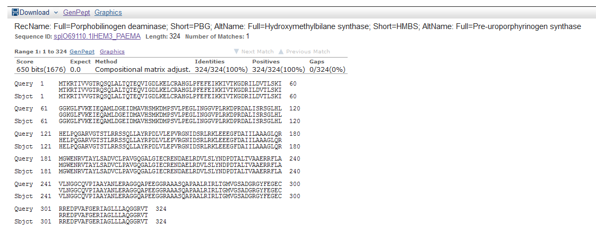

#My Favorite Gen

Crassostrea gigas 
_____

I found the first sequence in the GenBank this annotated whit Porphobilinogen deaminase protein
This is the screen 

Direct [link](http://www.ncbi.nlm.nih.gov/protein/11386777?report=genbank&log$=protalign&blast_rank=1&RID=2JEPHA8M01R7) to the web page

Blastn
My code 

`!blastn \ `
`-query ..\Z\query\Cgigasseq.fasta \`
`-db ..\Z\db\Geo_Male \`
`-task blastn \`
`-outfmt 6 \`
`-out out\Cgigasseq_blastn_G_M-fmt6.out`

When I run that I found:

Here is the result hit for C. gigas compared Geo Male

`gi|762162531|ref|XM_011421231.1|Geo_Pool_M_CTTGTA_L006_R1_001_val_1_(paired)_contig_3967 69.72	393	117	2	545	936	378	769	1e-039	165`

Other result

`gi|762162531|ref|XM_011421231.1|	Geo_Pool_M_CTTGTA_L006_R1_001_val_1_(paired)_contig_2317	95.24	21	1	0	85	105	1879	1899	6.3	33.7`

